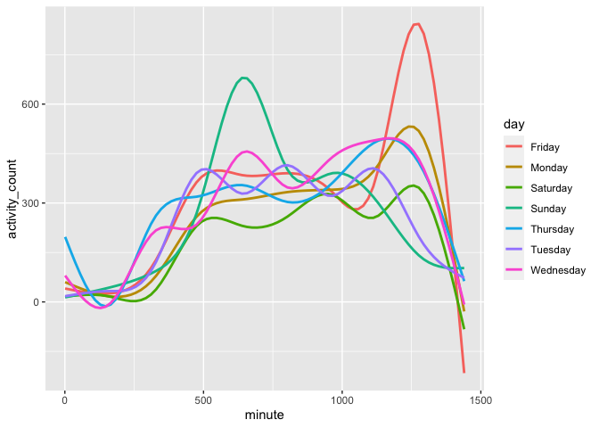
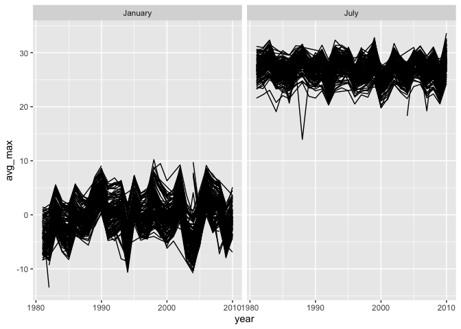
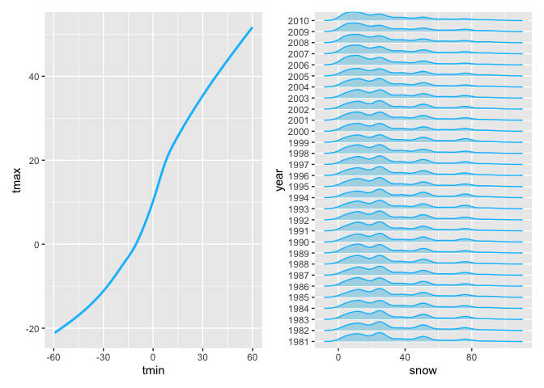

P8105 Homework 3
================
Thirsten Stockton
2022-10-15

# Problem 1

***Data Exploration***

Importing Data

``` r
data("instacart")

instacart = 
  instacart %>% 
  as_tibble(instacart)
```

Finding number of users

``` r
instacart %>%
  select(user_id) %>%
    distinct %>%
      count
```

    ## # A tibble: 1 × 1
    ##        n
    ##    <int>
    ## 1 131209

Average days in between orders (capped at 30)

``` r
mean(instacart$days_since_prior_order, na.rm =TRUE)
```

    ## [1] 17.06613

Finding peak order hours

``` r
max_df <-
instacart %>%
  group_by(order_hour_of_day) %>%
  summarize(
     n = n_distinct(order_id)
    ) 

max_df %>%
    arrange(desc(n))
```

    ## # A tibble: 24 × 2
    ##   order_hour_of_day     n
    ##               <int> <int>
    ## 1                14 11103
    ## 2                15 11075
    ## 3                13 10711
    ## 4                12 10622
    ## 5                11 10610
    ## # … with 19 more rows
    ## # ℹ Use `print(n = ...)` to see more rows

This dataset has 15 columns and 1,384,617 rows with each row
representing a product from an order. Key variables include information
on the customer identifier, order identifier and product name.
Additionally, there is information on the day of the week on which the
order was placed, the hour in which it was placed and number of days
since the previous order. To provide even more details, this dataset
also includes the department name and aisle in which the product would
be found. In total, there were a total of 131,209 unique users in this
dataset. The average day in between orders was \~17 days and on average,
orders peaked around 3pm.

***How many aisles are there, and which aisles are the most items
ordered from?***

``` r
instacart %>% 
  count(aisle) %>% 
   arrange(desc(n))
```

    ## # A tibble: 134 × 2
    ##   aisle                           n
    ##   <chr>                       <int>
    ## 1 fresh vegetables           150609
    ## 2 fresh fruits               150473
    ## 3 packaged vegetables fruits  78493
    ## 4 yogurt                      55240
    ## 5 packaged cheese             41699
    ## # … with 129 more rows
    ## # ℹ Use `print(n = ...)` to see more rows

There are 134 aisle and the most commonly ordered from aisles are the
fresh fruits, fresh vegetables, and packed fruit and vegetables aisles.

***Make a plot that shows the number of items ordered in each aisle,
limiting this to aisles with more than 10000 items ordered. Arrange
aisles sensibly, and organize your plot so others can read it.***

``` r
instacart %>% 
  count(aisle) %>% 
  filter(n > 10000) %>% 
  mutate(aisle = fct_reorder(aisle, n)) %>% 
  ggplot(aes(x = aisle, y = n)) + 
  geom_point() + 
  labs(title = "Number of items ordered in each aisle") +
  theme(axis.text.x = element_text(angle = 60, hjust = 1))
```

<!-- -->

***Make a table showing the three most popular items in each of the
aisles “baking ingredients”, “dog food care”, and “packaged vegetables
fruits”. Include the number of times each item is ordered in your
table.***

``` r
instacart %>% 
  filter(aisle %in% c("baking ingredients", "dog food care", "packaged vegetables fruits")) %>%
    group_by(aisle) %>% 
      count(product_name) %>% 
        mutate(rank = min_rank(desc(n))) %>% 
        filter(rank < 4) %>% 
          arrange(desc(n)) %>%
            knitr::kable()
```

| aisle                      | product_name                                  |    n | rank |
|:---------------------------|:----------------------------------------------|-----:|-----:|
| packaged vegetables fruits | Organic Baby Spinach                          | 9784 |    1 |
| packaged vegetables fruits | Organic Raspberries                           | 5546 |    2 |
| packaged vegetables fruits | Organic Blueberries                           | 4966 |    3 |
| baking ingredients         | Light Brown Sugar                             |  499 |    1 |
| baking ingredients         | Pure Baking Soda                              |  387 |    2 |
| baking ingredients         | Cane Sugar                                    |  336 |    3 |
| dog food care              | Snack Sticks Chicken & Rice Recipe Dog Treats |   30 |    1 |
| dog food care              | Organix Chicken & Brown Rice Recipe           |   28 |    2 |
| dog food care              | Small Dog Biscuits                            |   26 |    3 |

***Make a table showing the mean hour of the day at which Pink Lady
Apples and Coffee Ice Cream are ordered on each day of the week; format
this table for human readers (i.e. produce a 2 x 7 table).***

``` r
instacart %>%
  filter(product_name %in% c("Pink Lady Apples", "Coffee Ice Cream")) %>%
    group_by(product_name, order_dow) %>%
      summarize(mean_hour = mean(order_hour_of_day)) %>%
        spread(key = order_dow, value = mean_hour) %>%
           knitr::kable(digits = 2)
```

| product_name     |     0 |     1 |     2 |     3 |     4 |     5 |     6 |
|:-----------------|------:|------:|------:|------:|------:|------:|------:|
| Coffee Ice Cream | 13.77 | 14.32 | 15.38 | 15.32 | 15.22 | 12.26 | 13.83 |
| Pink Lady Apples | 13.44 | 11.36 | 11.70 | 14.25 | 11.55 | 12.78 | 11.94 |

# Problem 2

***Loading & cleaning data set***

``` r
accel <-
read.csv("./accel_data.csv") %>%
  janitor::clean_names() %>%
     pivot_longer(
          activity_1:activity_1440,
          names_to = "minute",
          values_to = 'activity_count' ) %>%
            mutate(minute = str_replace(minute, "activity_", "")) %>%
              mutate(minute = as.numeric(minute)) %>%
                  mutate( weekend = case_when( day %in% c( "Saturday","Sunday") ~ "Weekend",
                             day %in% c("Monday", "Tuesday", "Wednesday", "Thursday", "Friday") ~ "Weekday"
                  ))
                  
                
accel
```

    ## # A tibble: 50,400 × 6
    ##    week day_id day    minute activity_count weekend
    ##   <int>  <int> <chr>   <dbl>          <dbl> <chr>  
    ## 1     1      1 Friday      1           88.4 Weekday
    ## 2     1      1 Friday      2           82.2 Weekday
    ## 3     1      1 Friday      3           64.4 Weekday
    ## 4     1      1 Friday      4           70.0 Weekday
    ## 5     1      1 Friday      5           75.0 Weekday
    ## # … with 50,395 more rows
    ## # ℹ Use `print(n = ...)` to see more rows

The following dataset has 6 columns and 50,400 rows with each row
representing a singular minute that this participant was under
observation. Key variables include information on which week the
observation was conducted in, the day of the week, the day identifier,
minute of the day, and the activity levels for that given minute.
Additionally, there is a “weekend” variable to indicate whether the
observation was on a weekday or weekend.

***Analyzing trends in total activity***

``` r
accel %>%
  group_by (day_id) %>%
    summarize( total_activity = sum(activity_count)) %>%
        knitr::kable()
```

| day_id | total_activity |
|-------:|---------------:|
|      1 |      480542.62 |
|      2 |       78828.07 |
|      3 |      376254.00 |
|      4 |      631105.00 |
|      5 |      355923.64 |
|      6 |      307094.24 |
|      7 |      340115.01 |
|      8 |      568839.00 |
|      9 |      295431.00 |
|     10 |      607175.00 |
|     11 |      422018.00 |
|     12 |      474048.00 |
|     13 |      423245.00 |
|     14 |      440962.00 |
|     15 |      467420.00 |
|     16 |      685910.00 |
|     17 |      382928.00 |
|     18 |      467052.00 |
|     19 |      371230.00 |
|     20 |      381507.00 |
|     21 |      468869.00 |
|     22 |      154049.00 |
|     23 |      409450.00 |
|     24 |        1440.00 |
|     25 |      260617.00 |
|     26 |      340291.00 |
|     27 |      319568.00 |
|     28 |      434460.00 |
|     29 |      620860.00 |
|     30 |      389080.00 |
|     31 |        1440.00 |
|     32 |      138421.00 |
|     33 |      549658.00 |
|     34 |      367824.00 |
|     35 |      445366.00 |

Looking at the table that gives total activity counts for each day under
observation, there doesn’t seem to be any clear or definitive trends.

***Making Plot***

``` r
accel %>%
  ggplot(aes(x = minute, y= activity_count, color = day)) +
      geom_smooth(se = FALSE)
```

    ## `geom_smooth()` using method = 'gam' and formula 'y ~ s(x, bs = "cs")'

<!-- -->

Looking at this plot, it seems that there are higher peaks of activity
on the weekend, while the weekdays seem to be more even throughout the
day. Additionally, there is a noticeable drop in activity that is fairly
consistent across days.

# Problem 3

***Loading the dataset***

``` r
library(p8105.datasets)
data("ny_noaa")

ny_noaa
```

    ## # A tibble: 2,595,176 × 7
    ##   id          date        prcp  snow  snwd tmax  tmin 
    ##   <chr>       <date>     <int> <int> <int> <chr> <chr>
    ## 1 US1NYAB0001 2007-11-01    NA    NA    NA <NA>  <NA> 
    ## 2 US1NYAB0001 2007-11-02    NA    NA    NA <NA>  <NA> 
    ## 3 US1NYAB0001 2007-11-03    NA    NA    NA <NA>  <NA> 
    ## 4 US1NYAB0001 2007-11-04    NA    NA    NA <NA>  <NA> 
    ## 5 US1NYAB0001 2007-11-05    NA    NA    NA <NA>  <NA> 
    ## # … with 2,595,171 more rows
    ## # ℹ Use `print(n = ...)` to see more rows

***Inspecting missing values***

``` r
colSums(is.na(ny_noaa))
```

    ##      id    date    prcp    snow    snwd    tmax    tmin 
    ##       0       0  145838  381221  591786 1134358 1134420

This dataset has 7 columns and 2,595,176 rows with each row representing
weather conditions recorded at one of New York State’s Weather Stations
on a particular day. Key variables include weather station ID, date of
observation, precipitation, snowfall, and maximum and minimum
temperatures. There appears to be a decent amount of data missing from
this dataset with the most impacted variables being Temperature Max and
Temperature Min. They each have over 1,000,000 missing values.

***Data Cleaning***

``` r
ny_noaa =
  ny_noaa %>%
    separate(date, sep = "-", into = c("year", "month", "day")) %>% 
      mutate(day = as.integer(`day`)) %>%
        mutate(year = as.integer(`year`)) %>%
          mutate(tmax = as.integer(`tmax`)) %>%
            mutate(tmin = as.integer(`tmin`)) %>%
              mutate(tmax = tmax / 10 ) %>%
                mutate(tmin = tmin / 10) %>%
                    mutate(prcp = prcp /10)

ny_noaa
```

    ## # A tibble: 2,595,176 × 9
    ##   id           year month   day  prcp  snow  snwd  tmax  tmin
    ##   <chr>       <int> <chr> <int> <dbl> <int> <int> <dbl> <dbl>
    ## 1 US1NYAB0001  2007 11        1    NA    NA    NA    NA    NA
    ## 2 US1NYAB0001  2007 11        2    NA    NA    NA    NA    NA
    ## 3 US1NYAB0001  2007 11        3    NA    NA    NA    NA    NA
    ## 4 US1NYAB0001  2007 11        4    NA    NA    NA    NA    NA
    ## 5 US1NYAB0001  2007 11        5    NA    NA    NA    NA    NA
    ## # … with 2,595,171 more rows
    ## # ℹ Use `print(n = ...)` to see more rows

**Units: Snowfall: mm, Precipitation: mm, Temperature Max: Celsius,
Temperature Min: Celsius**

Way to find the most common snowfall amount

``` r
Mode <- function(x) {
  ux <- unique(x)
  ux[which.max(tabulate(match(x, ux)))]
}

Mode(ny_noaa$snow)
```

    ## [1] 0

Most commonly observed snowfall values

``` r
ny_noaa %>%
  count (snow) %>%
      arrange(desc(n))
```

    ## # A tibble: 282 × 2
    ##    snow       n
    ##   <int>   <int>
    ## 1     0 2008508
    ## 2    NA  381221
    ## 3    25   31022
    ## 4    13   23095
    ## 5    51   18274
    ## # … with 277 more rows
    ## # ℹ Use `print(n = ...)` to see more rows

The most commonly observed snowfall values were either 0mm of snowfall,
missing, or 25mm of snowfall. This is because there is a limited time in
the year in which snow falls, so for the majority of the year, a
snowfall of 0mm would not be unexpected.

***Make a two-panel plot showing the average max temperature in January
and in July in each station across years.***

``` r
ny_noaa %>%
   mutate(month = as.integer(`month`)) %>% 
      filter(month %in% c("1", "7")) %>%
          mutate(month = recode(month, "1" = "January", "7" = "July")) %>%
        group_by(month, year, id) %>%
          summarize(
              avg_max = mean(tmax, na.rm = TRUE),
          ) %>%
                ggplot(aes(x = year, y = avg_max, group = id)) +
  geom_line() +
  facet_grid(.~month)
```

    ## `summarise()` has grouped output by 'month', 'year'. You can override using the
    ## `.groups` argument.

    ## Warning: Removed 5640 row(s) containing missing values (geom_path).

<!-- -->

In the above graph, discerning various trends amongst stations is
difficult because of the amount of stations that were included in the
analysis. This graph does show general trends in average temperature in
each month across the years. There were a few outliers in July pre -
1990s.

***Make a two-panel plot showing (i) tmax vs tmin for the full dataset
(note that a scatterplot may not be the best option); and (ii) make a
plot showing the distribution of snowfall values greater than 0 and less
than 100 separately by year.***

``` r
library(ggridges)
library(patchwork)

temp_rel =
ny_noaa %>%
  ggplot(aes(x = tmin, y = tmax)) +
        geom_smooth( colour = "deepskyblue1", se = FALSE)

snow_dist =
ny_noaa %>%
  filter( snow > 0 & snow < 100) %>%
    mutate( year = as.character(year)) %>%
      ggplot(aes(x=snow, y = year)) +
        geom_density_ridges(scale = 0.85, colour = "deepskyblue1", fill = "lightblue")

(temp_rel + snow_dist)
```

    ## `geom_smooth()` using method = 'gam' and formula 'y ~ s(x, bs = "cs")'

    ## Warning: Removed 1136276 rows containing non-finite values (stat_smooth).

    ## Picking joint bandwidth of 3.76

<!-- -->
